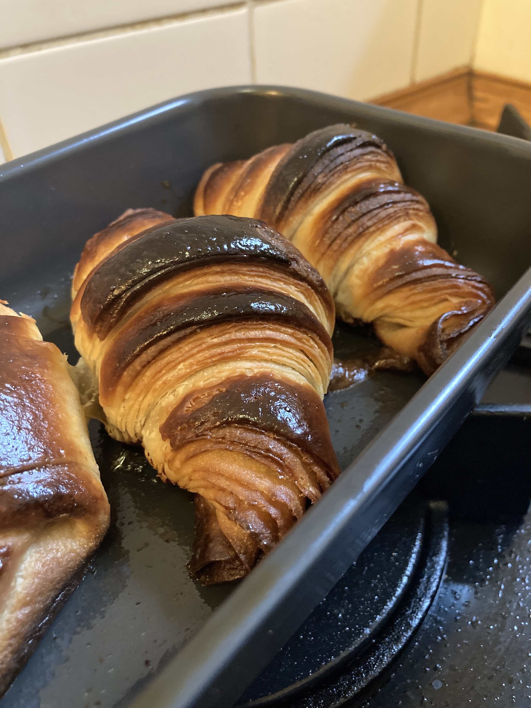

Mastering laminated dough is a long process, but the result, that flaky yet crunchy pastry is totally worth it. As with every adventure, our journey to making awesome croissants should start with one simple step. In this case a simple recipe.

Maybe sound heresy in the eyes of some baker ninjas, but I think for a POC(proof of concept) croissant, we don't need to understand everything, just make something and we should aim for a good enough result to see if we can wake up our inner baker side :D After we do this we can start tweaking the recipe, methods and increase our knowledge about the topic. 

I tested a simple yet nice recipe which can be a good starting point. It's easy to make and the end result can be super delicious and usually evaporates when I bring the croissant into the office. 

DISCLAIMER: Even though this is a simpler recipe, it still takes 2 days until you can eat your final pastries. This is because we give the dough much time to rest, relax and develop the flavours that we want in our product.

Ingredients:
- 100g water, 100g  flour and 2 g yeast for the poolish
- 500g  flour
- 225 fatty or whole milk
- 12g salt,
- 5g yeast
- 45g sugar
- 250g butter

Note: 
You can use all-purpose or plain flour or bread flour whatever you want or have. Remember, we don't want to stuck on details, just key points. 
I usually buy instant dry yeast, which comes in small 7g packages so it's easy to use for this recipe. 

First, we create the poolish. Combine 100g water, 100g flour and 2g yeast in a mixing bowl and cover it. Now we wait for 2-4 hours (depending on the temperature of our room/kitchen) until it has a lot of bubbles and is raised to 1.5-2x of its size. That's it. Poolish is a pre-fermentation thing that makes our final product soft and fragrant and we kickstart our gluten and flavour development at an early stage. 

When the poolish is ready we mix it with the rest of the ingredients except the butter. Don't start to kneed at this point. When the dough seems homogenous, cover it and let it rest for 30 min. It could be a good idea to move to a clean bowl, but it's an optional step. 
After letting the dough rest,  we will do the first stretch and fold. Grab the bottom of the dough on one side and stretch and fold it to the upper side. Turn the bowl to a 90-degree angle and do it again and repeat it until you return to the first fold.

We will let the dough rest again for 30 min and do another stretch and fold, and do a third one after 30 min. Cover the dough with foil or put it in a bag during resting. At this point, we grab our rolling pin and roll out the dough to a rectangle shape (30x40 cm) and put it into the fridge for 2 hours to cool it down nicely. 

After 1.5 hours it is time to create the butter block. Cut the butter up and arrange it in a rectangle like shape on parchment paper. You can use 2 papers or one bigger one which you fold into a 20x30 cm rectangle. Use the rolling pin to shape the butter into the desired size and shape. Put the block back into the fridge until the remaining time. 

Now we are ready for the lamination. 

We will work faster here. The important note is to keep the dough and the butter at the same cool temperature. This way we make sure that the layers are not destroyed during the process. 
Take out the dough and the butter from the fridge. Put the butter block in the centre of the dough block. Fold the 2 outer sides of the dough to cover the butter. Now gently roll the dough and when it reached a length around 50-60cm. Make sure you don't push too hard, we want an equally thick butter and dough layer everywhere. After this, rotate it by 90 degrees. Divide the dough into 3 equal parts in your head and fold one of the outer parts into the middle and fold the other part right to the top of that third. 

If you feel that the dought is getting warm, just put it back into the fridge for 10-15 minutes and continue with another fold.

We will repeat the previous fold. Roll out the dough for around a 30x50 shape (or until you feel comfortable that you can do the fold and roll it out again). Take one of the outer thirds, fold it into the middle and take the other third and fold it to the top. 
If you are the visual type and my description was not enough, here is a video about the [lamination][https://youtu.be/712xtDkLre0?t=72].
The baker here uses an industrial machine to roll the dough, but the method he uses for folding is the same. 

Now you are done. See? It was easy. Your nice looking layered dough is ready to rest again for an hour in the fridge.

After the rest comes another fun part. Roll out the dough into a 25-30x60cm rectangle. Give it a couple of minutes to relax on the counter, so when you cut it, it doesn't pull back to itself. 
Cut the dough into 6-12 triangles, depending on how big croissant you prefer. I usually do 8 or 10 (mostly 8), but that's just me, feel free to experiment, try out things here.  Cut a 1 or 2 cm line in the middle of the base of the triangles and roll them up to little croissant shapes and transfer them into a baking sheet. I usually use some parchment on the sheets 

The important step here is to tap yourself on the shoulder and just look at your croissants. Be amazed. Talk to them. Say some nice things to yourself and to the croissants. It helps.
Cover the sheet with foil or put it in a bag and let the croissant have a nice good night sleep. 
In the morning, take out the croissants and let them rise for 1.5-2 hours or until they rise to 1.5-2x of their original size. 

Beat up an egg and give them a good brush, so they become nicely golden brown. 
Bake the croissant at 220 celsius for 30 min, but be sure to regularly check them to see what's happening. 

Take them out and try not the give into the temptation to grab one as soon as possible. The smell of freshly baked croissants is so hard to resist, especially when it fills up your home, but you must be strong. 

Wait for them to cool a little bit. 
Make yourself a good coffee or pour out a glass of milk (or both) and enjoy your fresh croissants. With this start, your day must be awesome. 

Thanks for baking with me and reading the recipe. I hope you had a great experience and this will kickstart your croissant making carrier. 
In the future, I will add additional croissant and pastry recipes and explain technics with a bit more detail and add more complexity and even create some pictures where I am the one representing the different methods.

Have a great day and see you in the next post!!